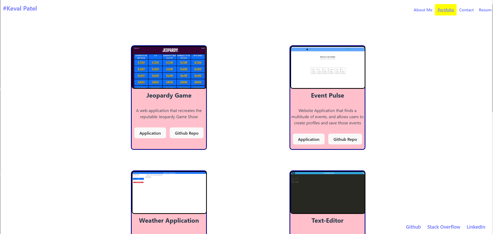

# Developer-Portfolio   

## Description

This is a repository for my developer portfolio. It was created in order to showcase my work to prospective employers. From creating this application, I was able to create my first web application using React. From creating this application as a developer, I was able to further enhance my proficiency in using React components to render pieces of a webpage at a time depending on the state. 

## Usage

In order to use this project, you will need to go to the deployed website >>> Click [Here](https://brilliant-crisp-fbf9ab.netlify.app/Portfolio). When hitting the landing page you will notice that you are taken to the About Me Section that tells a little about the author (Me). At the top of the page you can see a navigation bar that takes you to different pages. Clicking on navigation bar title will redirect you to that page. You will notice that the url changes depending on which navigation bar title you click. Also, clicking my name in the top left hand corner will take you to a home page that is different from the landing page. Below you can see a screen shot of the landing page. 

If you navigate to the 'Resume' page. You can see a list of the authors proficiencies as well as 'Download Full Resume' Link that will begin downloading a pdf version of my full resume. Below is a screenshot of the 'Resume' page. 

If you navigate to the 'Portfolio' Page you can see a list of 6 recently build web applications. Clicking on the image or the Application button will redirect you to a link to the deployed application. Clicking on the Github Repo button for any of the applications will redirect you to the Github repository for that particular application. Below you can see a screen shot of this.

If you navigate to the 'Contact' page you can fill out information to contact me. You can see that the email and name fields are required. Clickingg on the email and clicking away will prompt a message to show up telling the user that this field is required. Also, the email is checked against a Regex that will determine if the input is a valid form of an email. Below you can see a screen shot of this.

## Credits 

I would like give credit to chat.openai.com for helping me with some error handling and syntax errors in my code. I would also like to attribute the background image to upklyak on Freepik.  The following is the attribute link for the background image: `<a href="https://www.freepik.com/free-vector/web-development-programmer-engineering-coding-website-augmented-reality-interface-screens-developer-project-engineer-programming-software-application-design-cartoon-illustration_10798281.htm#query=web%20developer&position=0&from_view=keyword&track=ais">Image by upklyak</a> on Freepik`

## License

MIT License

Copyright (c) [2023] [Keval Patel]
        
Permission is hereby granted, free of charge, to any person obtaining a copy
of this software and associated documentation files (the "Software"), to deal
in the Software without restriction, including without limitation the rights
to use, copy, modify, merge, publish, distribute, sublicense, and/or sell
copies of the Software, and to permit persons to whom the Software is
furnished to do so, subject to the following conditions:

The above copyright notice and this permission notice shall be included in all
copies or substantial portions of the Software.

THE SOFTWARE IS PROVIDED "AS IS", WITHOUT WARRANTY OF ANY KIND, EXPRESS OR
IMPLIED, INCLUDING BUT NOT LIMITED TO THE WARRANTIES OF MERCHANTABILITY,
FITNESS FOR A PARTICULAR PURPOSE AND NONINFRINGEMENT. IN NO EVENT SHALL THE
AUTHORS OR COPYRIGHT HOLDERS BE LIABLE FOR ANY CLAIM, DAMAGES OR OTHER
LIABILITY, WHETHER IN AN ACTION OF CONTRACT, TORT OR OTHERWISE, ARISING FROM,
OUT OF OR IN CONNECTION WITH THE SOFTWARE OR THE USE OR OTHER DEALINGS IN THE
SOFTWARE.

## Questions

If you would like to reach out to me with any questions, you can email me directly at: [khp90611@gmail.com](mailto:khp90611@gmail.com)

Also, you can visit my github profile page [here](https://github.com/KevalPatel6).